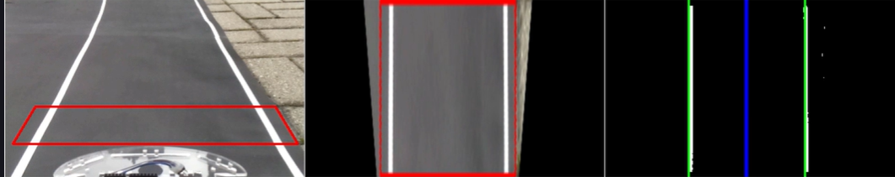
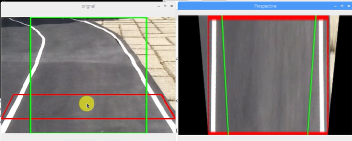
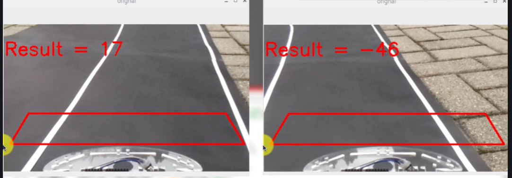

# 🚗 Lane Detection with Perspective Transform

This C++ OpenCV project captures live images using the Raspberry Pi camera, allows selection of 4 points for a perspective transform (bird's eye view), performs brightness enhancement, thresholding, edge detection, and histogram analysis.

---

## 📦 Features

- Real-time image capture using `libcamera-still`
- Click-based point selection for perspective transformation
- Brightness enhancement
- Binary + edge-based lane segmentation
- Histogram visualization of the bottom frame slice
- Master Slave communication between Raspberry pi (which processes the image) and Arduino Uno (which controls the wheels)
- Graceful exit with `Ctrl+C` or `q`

---

## 🛠️ Requirements

- OpenCV (C++ version)
- Raspberry Pi with Camera (uses `libcamera-still`)
- A monitor or SSH with GUI forwarding

---

## 🧠 How It Works

1. **Capture Image:** Captures still image using `libcamera-still`.
2. **Click to Select 4 Points:** Define the lane region on screen.
3. **Transform:** Creates a bird’s eye view using `cv::getPerspectiveTransform`.
4. **Enhance & Segment:** Increases brightness and applies threshold + edge detection.
5. **Histogram:** Generates a histogram showing pixel activity in lower frame region.
6. **Master Slave Communication:** According to the offset value in the histogram, the raspberry pi send signals to the Arduino Uno.
7. **Movement:** The Arduino Uno with the help of L298 motor driver, controls the wheels

---

## 🚀 Compile and Run

Make sure OpenCV is installed and linked correctly.

### 🔧 Compile:

```bash
g++ -o lane_detector lane_detector.cpp `pkg-config --cflags --libs opencv4`
```

> If you're using OpenCV 3, replace `opencv4` with `opencv`.

### ▶️ Run:

```bash
./lane_detector
```

> Click 4 points on the "Full Frame" window to define the Area of Interest.

---

## 🖼️ Sample Results

### 📷 Full Frame with AOI  
Shows original image with the selected lane region.



---

### 🔄 Bird's Eye View  
Perspective-transformed view of the lane area.



---

### 📊 Histogram Output  
Histogram showing pixel intensity at the frame bottom.



---

---

## ✅ Notes

- Press `q` to quit preview window.
- Press `Ctrl+C` in terminal to stop execution gracefully.
